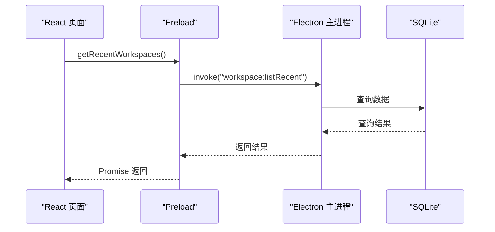

```mermaid
sequenceDiagram
participant React as "React 页面"
participant Preload as "Preload"
participant Main as "Electron 主进程"
participant DB as "SQLite"

    React->>Preload: getRecentWorkspaces()
    Preload->>Main: invoke("workspace:listRecent")
    Main->>DB: 查询数据
    DB-->>Main: 查询结果
    Main-->>Preload: 返回结果
    Preload-->>React: Promise 返回

```
